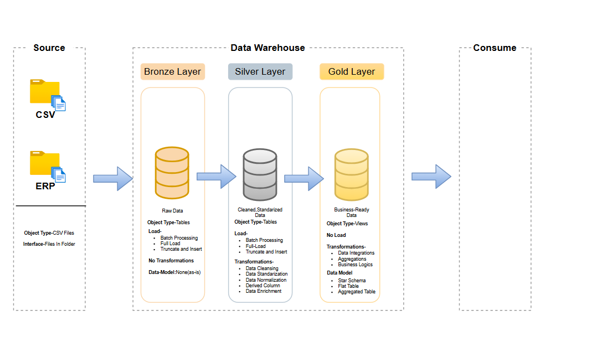
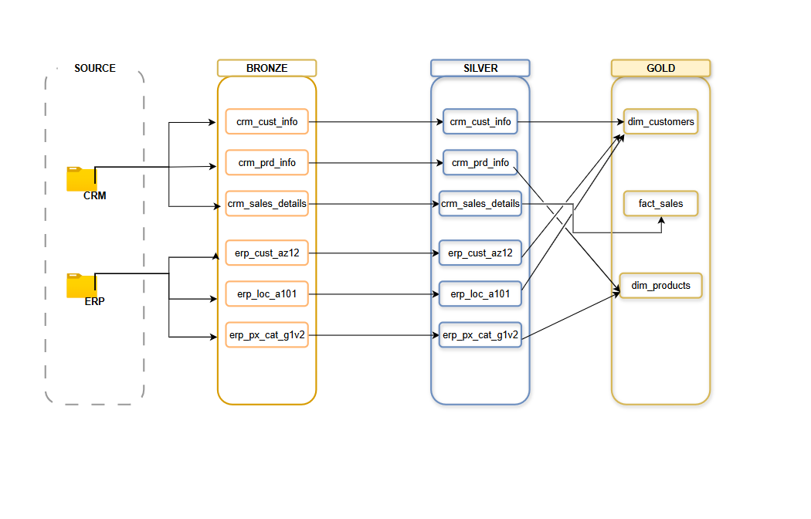
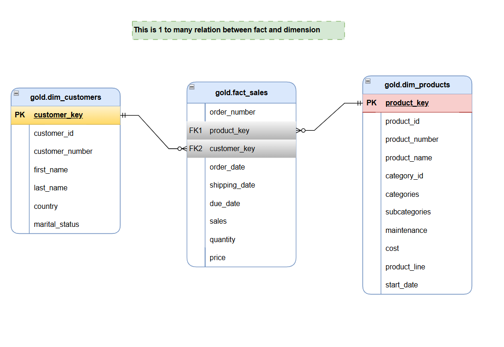
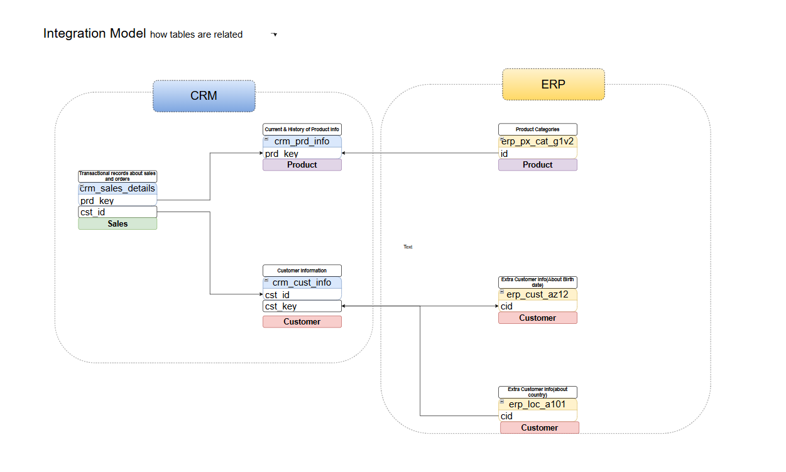

# 🏗️ End-to-End E-Commerce Analytics ETL Pipeline

## 📦 Overview

This project demonstrates a **modern layered data warehouse architecture** using **Bronze**, **Silver**, and **Gold** stages to transform raw operational data into high-quality, analysis-ready datasets. Designed to support business reporting, audit trails, and future dashboarding integrations.

---

## 🧱 Architecture Layers




### 🥉 Bronze Layer
> *Raw Ingested Data*

- Stores data extracted from operational systems (CSV, Excel, etc.).
- Light transformation only: column renaming, type casting, etc.
- Used as a historical log and source of truth.

### 🥈 Silver Layer
> *Cleaned & Conformed Data*

- Handles **data cleaning**, **null checks**, and **type standardization**.
- Applies joins and enriches data from multiple bronze tables.
- Provides a clean base for analytical modeling.



### 🥇 Gold Layer
> *Business-Ready, Analytical Data*

- Implements **Star Schema** with **Fact** and **Dimension** tables.
- Transforms cleaned data into aggregated, semantic-rich views.
- Ready for integration with reporting tools like Power BI (in the future).

---


## 🤖 Coming Soon: Python Automation Scripts

- ✅ Automating **bulk insertions** from folders.
- ✅ Automating **column data profiling and summaries**.
- ✅ Simplifying repetitive transformations via **Python helpers**.
- 📁 Scripts will be added in the `automation/` folder.
- Boosting efficiency and reducing manual effort in ETL processes.

---



## 🧾 Data Model (Drawn with draw.io)

- `fact_sales` 💰 — Core transactional data.
- `dim_customers` 👤 — Customer-related information.
- `dim_products` 🛒 — Product catalog and attributes.

> 📌 See `data_catalog.md` for complete table dictionary with emoji legends.

---


## ⚙️ How It Works

1. **Ingest Raw Files** into the Bronze layer.
2. **Apply SQL Transformations** to clean & normalize into Silver layer.
3. **Create Analytical Views** in Gold layer using star schema.
4. (Optional) Future-ready to connect Power BI or other BI tools.
5. 🔧 Future Python scripts to handle repetitive insert and transformation tasks.

---

## 📂 Folder Structure

```bash
📁 bronze/
    └── raw files from locally stored csv files
📁 silver/
    └── cleaning the uncleaned data from bronze layer
📁 gold/
    ├── fact_sales.sql
    ├── dim_customers.sql
    ├── dim_products.sql
📁 automation/
    └── bulk_insert.py (coming soon)
📄 data_catalog.md
📄 README.md
```

## 📌 Tech Stack
- **SQL Server**  
- **Data Modelling**  
- **draw.io**

  ---

## 🤝 Connect with Me  

If you have any questions, feedback, or suggestions about this project, feel free to reach out!  
💬 Let’s connect on

💼 [LinkedIn](https://www.linkedin.com/in/pradumnchauhan)!

📧 [Email](pradumnchauhan2812@gmail.com)!
